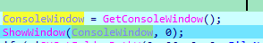
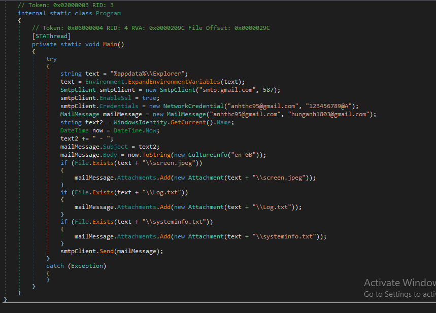

# Sample 01

## 1, Overview


## 2, Technique: các kĩ thuật sử dụng (theo ATT&CK)

- Persistence TA0003

  - Registry Run Keys / Startup Folder T1547.001
  - DLL Side-Loading T1574.002
- Process Injection T1055
- Hidden Window T1564.003
- Keylogging T1056.001
- Query Registry T1012
- Application Layer Protocol T1071
Uses SMTP (mail sending)

## 3, Phân tích

### Tạo thư mục EXPLORER

- phân tích main()


- Đầu tiên chương trình sẽ lấy handle của Console bằng hàm `GetConsoleWindow()` sau đó gọi hàm `ShowWindow()` với đối số truyền vào là handle vừa lấy được và số 0.

```
BOOL ShowWindow(
  [in] HWND hWnd,
  [in] int  nCmdShow
);
```


- Nếu đối số thứ 2 là 0 thì hàm có chức năng ẩn cửa sổ console đó.


- Tiếp theo chương trình sẽ get folder mà nó chỉ định để tạo directory và set attributes cho file tên là "Explorer"

### Tạo Unikey.exe


- Tiếp theo sẽ call đến hàm sub_A11220()
  - Đầu tiên hàm thực hiện đổi tên file từ `Explorer.exe` thành `Unikey.exe`
  
  - Sau đó sẽ create 1 registry key và set value key là Unikey NT ở key RUN để mỗi lần khởi động máy sẽ chạy file này

### Tạo Transfer.exe và Systeminfo.txt


- Sau đó chương trình sẽ thực hiện tạo 1 file exe có tên  là `Transfer.exe` và call tới hàm sub_314F0()


- Đầu tiên nó sẽ tạo 1 file txt là `systeminfo.txt` sau đó mở key `HARDWARE\\DESCRIPTION\\System\\CentralProcessor` ghi vào trường `ProcessorNameString` 
- Tiếp đến call hàm  sub_31930(FileW)


- Ở đây đầu tiên chương trình sẽ ghi vào file txt "Danh sach phan mem tren may:" và mở key `SOFTWARE\\Microsoft\\Windows\\CurrentVersion\\Uninstall` sau đó sẽ lấy thông tin như DisplayName, DisplayVersion,InstallLocation để ghi lần lượt vào file `systeminfo.txt` 


### Tạo Keylog.dll và Log.txt

- Tiếp theo sẽ tạo 1 thread, đi tới địa chỉ mà chương trình truyền vào.


- Ở đây chương trình sẽ tạo "KeyLog.dll" và ghi file, lấy địa chỉ và gọi tới  2 hàm trong dll đó là "FillKeyboard", "SetGlobalHookHandle"

- Đi đến folder chứa file dll này và đáp vào IDA để xem nó gọi hàm này làm gì.


- Ở hàm "FillKeyboard" sẽ tạo 1 file "Log.txt" và ghi vào file log thời gian truy cập, tên đường dẫn tệp thao tác, ứng dụng và ký tự thao tác với ứng dụng


### Chạy file Transfer.exe

- Tiếp tục với hàm chính của chương trình 


- Nhảy vào hàm sub_31790()


- hàm này sẽ thực hiện chụp lại màn hình và lưu vào "screen.jpeg"

- hàm system() thực thi cmd với file "Transfer.exe"

- Đây là file .net nên ta sẽ sử dụng tool dnspy để decompile.


- File này sử dụng SmtpClient . Sử dụng mail "anhthc95@gmail.com", "123456789@A" và send đến "hunganh1803@gmail.com". Nó sẽ send 3 file log đã lưu vào là "screen.jpg" , "log.txt" , "systeminfo.txt".